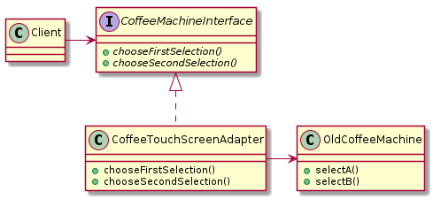
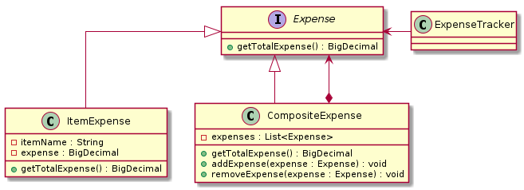

= Design Patterns

Examples of some of the most  common Gang of Four (Gof) Design Patterns

== Adapter Pattern

The purpose of the adapter pattern is to adapt two incompatible interfaces to
make them work togeter so that the client can continue to use the same
interface it has always used, but allows the adapter to delegate the client 
requests to the new interface.

=== Class Diagram

== Composite Pattern

The purpose of the composite pattern is to compose objects into tree structures 
to represent part-whole hierarchies. Composite lets clients treat individual 
objects and compositions of objects uniformly.

=== Class Diagram
